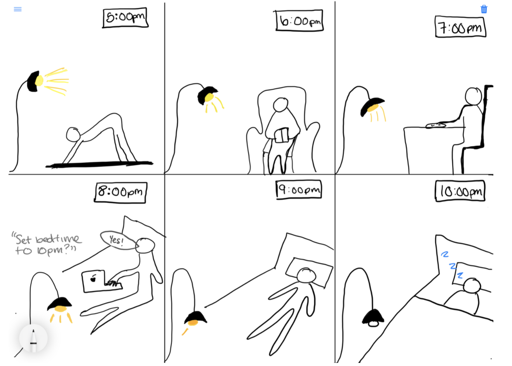

# Staging Interaction Lab

## Prep

### For this lab, you will need:
1. Paper
2. Markers/ Pens
3. Scissors
4. Smart Phone 
5. Computer 
6. Found objects and materials

### Deliverables for this lab are: 
1. Storyboard
2. Sketches/photos of costumed device
3. Any reflections you have on the process
4. Video sketch of the prototyped interaction
5. Submit the items above in the lab1 folder of your class [Github page], either as links or uploaded files. Each group member should post their own copy of the work to their own Lab Hub, even if some of the work is the same from each person in the group.

### The Report
This README.md page in your own repository should be edited to include the work you have done (the deliverables mentioned above). 

## Lab Overview

A) [Plan](#part-a-plan) 

B) [Act out the interaction](#part-b-act-out-the-interaction) 

C) [Prototype the device](#part-c-prototype-the-device)

D) [Wizard the device](#part-d-wizard-the-device) 

E) [Costume the device](#part-e-costume-the-device)

F) [Record the interaction](#part-f-record)

## Part A. Plan 

\*\***Describe your setting, players, activity and goals here.**\*\*

> Setting: This interaction happens in a user's home, or anywhere else where they plan on sleeping that evening. 

> Players: This device is designed for a single user, in this case the individual attempting to manage their sleep cycle with an "inverse alarm clock." For this lab, we will keep the scope small as we develop a MVP, so the user is the sole player in the interaction. However, in future iterations, this can be used for a couple, family with children, or a household with multiple individuals trying to sleep.  

> Activity: The user begins by setting a bedtime. The "inverse alarm clock" then begins a "sleep cycle" ~2 hours beforehand. This includes dimming of household lights, electronics, and even window shades (in a more advanced version). Rather than an individual going from 100% awake to 100% asleep (or try to), this uses lighting to gradually set a mood, inherently telling the body that bedtime is close. 

> Goals: The goal of each user, simply put, is to fall asleep. Sleep is very misunderstood, but we do know that in the modern world the use of lights and electronics have made people go to bed later and later, which is unhealthy. However, dimming lights can be a successful strategy to reduce the “idle time” of waiting in bed trying to fall asleep. 

> Inspiration: Our lamp idea was inspired by sunflowers, their overall shape and movement based on light present. 

\*\***Include a picture of your storyboard here**\*\*

\*\***Summarize feedback you got here.**\*\*

Different feedback from ourselves and other peers include: 

> Cell phone light can keep a user awake just as much as room lighting can

> Sometimes a user does not plan a bed time, they just go to bed when they are tired

> If a user goes into multiple rooms, the lights (devices) across the whole house should be set up accordingly

## Part B. Act out the Interaction

\*\***Are there things that seemed better on paper than acted out?**\*\*

> The effect of the lights did not seem as prominent when acted out. This could be due to the lamp and its lack of actually changing brightness. 

> The lights we used for acting out are in the user’s bedroom. However, in a home with more than a single room, there may need to be multiple lights installed. 

\*\***Are there new ideas that occur to you or your collaborators that come up from the acting?**\*\*

> One idea could be integration with other devices. So for example, the lights in the apartment may dim, but at the same time the user’s computer, phone or television could also dim. 

> Another idea could be to have more than just light - sound could be helpful both as an input and an output. As an input, the user could ask the device to extend their bedtime (or initially set it) by just speaking out loud. Alternatively, sound could be used in parallel with the light, such as the device saying “you have 1 hour before your scheduled bedtime.” 

## Part C. Prototype the device

\*\***Give us feedback on Tinkerbelle.**\*\*

> In the house apartments there are flexible standing lamps, we are using this as the prototype. However we will manually move the lamp to present our idea and give the light dimming effect. 

## Part D. Wizard the device

\*\***Include your first attempts at recording the set-up video here.**\*\*

\*\***Show the follow-up work here.**\*\*

## Part E. Costume the device

\*\***Include sketches of what your device might look like here.**\*\*

>For sketches, refer back to the storyboard. This captures the overall shape and brightness of the lamp. 

\*\***What concerns or opportunitities are influencing the way you've designed the device to look?**\*\*

>The device will look like the flexible standing lamps in the house apartments, however it will move automatically lower as the time approaches the preset bedtime the user has set. Starting up high and bright and lowering getting dimmer and dimmer until the light shuts off. Design for the product should be similar (hardware/looks wise) to a lamp, in terms of not exposing it to water, using electricity, placement in a room, etc.

>For the purpose of prototyping we created a fake knob allowing the user to set their bedtime made from a bottle cap and paper. 

## Part F. Record

\*\***Take a video of your prototyped interaction.**\*\*

https://youtu.be/RV3dAaPuWmE

\*\***Please indicate anyone you collaborated with on this Lab.**\*\*

Our team is the following: 
- Robert Konigsberg (rak275)
- Bella Baidak (bb568)
- Jose Patricio Reyes Lorenzo (jr895)

# Staging Interaction, Part 2 

This describes the second week's work for this lab activity.

## Prep (to be done before Lab on Wednesday)

You will be assigned three partners from another group. Go to their github pages, view their videos, and provide them with reactions, suggestions & feedback: explain to them what you saw happening in their video. Guess the scene and the goals of the character. Ask them about anything that wasn’t clear. 

\*\***Summarize feedback from your partners here.**\*\*

## Make it your own

Do last week’s assignment again, but this time: 
1) It doesn’t have to (just) use light, 
2) You can use any modality (e.g., vibration, sound) to prototype the behaviors! Again, be creative!
3) We will be grading with an emphasis on creativity. 

\*\***Document everything here. (Particularly, we would like to see the storyboard and video, although photos of the prototype are also great.)**\*\*
