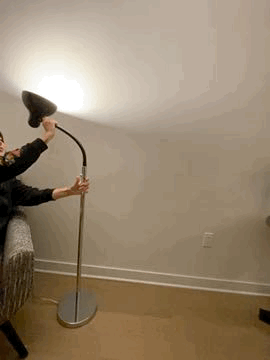

# Staging Interaction Lab

## Prep

### For this lab, you will need:
1. Paper
2. Markers/ Pens
3. Scissors
4. Smart Phone 
5. Computer 
6. Found objects and materials

### Deliverables for this lab are: 
1. Storyboard
2. Sketches/photos of costumed device
3. Any reflections you have on the process
4. Video sketch of the prototyped interaction
5. Submit the items above in the lab1 folder of your class [Github page], either as links or uploaded files. Each group member should post their own copy of the work to their own Lab Hub, even if some of the work is the same from each person in the group.

### The Report
This README.md page in your own repository should be edited to include the work you have done (the deliverables mentioned above). 

## Lab Overview

A) [Plan](#part-a-plan) 

B) [Act out the interaction](#part-b-act-out-the-interaction) 

C) [Prototype the device](#part-c-prototype-the-device)

D) [Wizard the device](#part-d-wizard-the-device) 

E) [Costume the device](#part-e-costume-the-device)

F) [Record the interaction](#part-f-record)

## Part A. Plan 

\*\***Describe your setting, players, activity and goals here.**\*\*

> Setting: This interaction happens in a user's home, or anywhere else where they plan on sleeping that evening. 

> Players: This device is designed for a single user, in this case the individual attempting to manage their sleep cycle with an "inverse alarm clock." For this lab, we will keep the scope small as we develop a MVP, so the user is the sole player in the interaction. However, in future iterations, this can be used for a couple, family with children, or a household with multiple individuals trying to sleep.  

> Activity: The user begins by setting a bedtime. The "inverse alarm clock" then begins a "sleep cycle" ~2 hours beforehand. This includes dimming of household lights, electronics, and even window shades (in a more advanced version). Rather than an individual going from 100% awake to 100% asleep (or try to), this uses lighting to gradually set a mood, inherently telling the body that bedtime is close. 

> Goals: The goal of each user, simply put, is to fall asleep. Sleep is very misunderstood, but we do know that in the modern world the use of lights and electronics have made people go to bed later and later, which is unhealthy. However, dimming lights can be a successful strategy to reduce the “idle time” of waiting in bed trying to fall asleep. 

> Inspiration: Our lamp idea was inspired by sunflowers, their overall shape and movement based on light present. 

\*\***Include a picture of your storyboard here**\*\*

\*\***Summarize feedback you got here.**\*\*

Different feedback from ourselves and other peers include: 

> Cell phone light can keep a user awake just as much as room lighting can

> Sometimes a user does not plan a bed time, they just go to bed when they are tired

> If a user goes into multiple rooms, the lights (devices) across the whole house should be set up accordingly

## Part B. Act out the Interaction

\*\***Are there things that seemed better on paper than acted out?**\*\*

> The effect of the lights did not seem as prominent when acted out. This could be due to the lamp and its lack of actually changing brightness. 

> The lights we used for acting out are in the user’s bedroom. However, in a home with more than a single room, there may need to be multiple lights installed. 

\*\***Are there new ideas that occur to you or your collaborators that come up from the acting?**\*\*

> One idea could be integration with other devices. So for example, the lights in the apartment may dim, but at the same time the user’s computer, phone or television could also dim. 

> Another idea could be to have more than just light - sound could be helpful both as an input and an output. As an input, the user could ask the device to extend their bedtime (or initially set it) by just speaking out loud. Alternatively, sound could be used in parallel with the light, such as the device saying “you have 1 hour before your scheduled bedtime.” 

## Part C. Prototype the device

\*\***Give us feedback on Tinkerbelle.**\*\*

> In the house apartments there are flexible standing lamps, we are using this as the prototype. However we will manually move the lamp to present our idea and give the light dimming effect. 

## Part D. Wizard the device

\*\***Include your first attempts at recording the set-up video here.**\*\*

\*\***Show the follow-up work here.**\*\*

## Part E. Costume the device

\*\***Include sketches of what your device might look like here.**\*\*

>For sketches, refer back to the storyboard. This captures the overall shape and brightness of the lamp. 

\*\***What concerns or opportunitities are influencing the way you've designed the device to look?**\*\*

>The device will look like the flexible standing lamps in the house apartments, however it will move automatically lower as the time approaches the preset bedtime the user has set. Starting up high and bright and lowering getting dimmer and dimmer until the light shuts off. Design for the product should be similar (hardware/looks wise) to a lamp, in terms of not exposing it to water, using electricity, placement in a room, etc.

>For the purpose of prototyping we created a fake knob allowing the user to set their bedtime made from a bottle cap and paper. 

## Part F. Record

\*\***Take a video of your prototyped interaction.**\*\*

https://youtu.be/RV3dAaPuWmE

\*\***Please indicate anyone you collaborated with on this Lab.**\*\*

Our team is the following:
- Bella Baidak (bb568)
- Robert Konigsberg (rak275)
- Jose Patricio Reyes Lorenzo (jr895)

# Staging Interaction, Part 2 

This describes the second week's work for this lab activity.

## Prep (to be done before Lab on Wednesday)

You will be assigned three partners from another group. Go to their github pages, view their videos, and provide them with reactions, suggestions & feedback: explain to them what you saw happening in their video. Guess the scene and the goals of the character. Ask them about anything that wasn’t clear. 

\*\***Summarize feedback from your partners here.**\*\*

The feedback received for this device can be summarized by the following: 

Positive feedback
> The physicality of the light lowering, as the night goes down, is a cool feature. 

> As someone who tends to stay up because I don't realize how late it is, I definitely appreciate this device!

> Not only does this device change the light environment around users, but reminds people to sleep in an immersive way

Food for thought / Suggestions for change
> Human schedules are complex, and simply reducing light may not work for those without a strict schedule. 

> Bedtimes are variable, and so syncing with someone's calendar may be valuable.

> There is a lack of clarity of when the lamp raises up after lowering at the end of the night.

> With a lamp so close to the ground, users may trip over it if they awake in the middle of the night.

> Is there any integration with the other lights in the house? What happens to those? 

> Changing colors / reducing blue light specifically could be a good way to induce sleep.

> Is there a snooze button? What is I struggle to wake-up. 

## Make it your own

Do last week’s assignment again, but this time: 
1) It doesn’t have to (just) use light, 
2) You can use any modality (e.g., vibration, sound) to prototype the behaviors! Again, be creative!
3) We will be grading with an emphasis on creativity. 

\*\***Document everything here. (Particularly, we would like to see the storyboard and video, although photos of the prototype are also great.)**\*\*

Given the feedback received, the following changes will be implemented: 
1. The device will work not just in the evenings to help users fall asleep, but also in the morning to help users wake up. This creates a "whole cycle" and addresses the concerns about when the lamp will raise after the user goes to sleep. 
2. We will introduce an app that allows users to set the bedtime and wake up time. Some of the key features include: 
    > Bedtime and wake-up can be changed within a single cycle (e.g., if it is 9:00pm, and a user planned to go to bed at 10:00pm, but now  need to go to bed at 11:00pm, the user can go into the app and change the bedimte accordingly). This will help with the complexity of a user's schedule on a day to day basis. 
    
    > Calendar integration will be possible (e.g., sync with Outlook calendar). 
    
    > For the wake-up functionality, there will be a built in "snooze" feature. Rather than a user clicking snooze in the morning, this will be proactive. So for example, a user will input 7:00 am as a wake-up time, but begin the wake-up process at 6:45am and have a "final wake-up allowed" at 7:15am. This is defined as the time interval. 
    
    > If the user has any other "smart lightbulbs" in the house, this device can sync with those. Although they may not have a dimming feature, the app can turn off each of the additional lights across the dimming cycle (and the user can program this sequence). So for example, if a user is going to bed in 4 hours, 3 hours beforehand the kitchen light can turn off, 2 hours beforehand the dining room light can shut off, and so on. Given the sophistication, it is not reflected in the diagrams below, but we do plan this for future iterations potentially. 
3. The light used in the lamp will have the functionality to include or exclude blue light. Therefore, at night time, blue light can be removed (something that has been showed to keep people awake at night). 
4. The light can allow a user to change the hue (e.g., more of a yellow / warm light versus a white / brighter light). 
5. A speaker will be built into the lamp, so that intervals can be announced (rather than the light dimming, for example). So the device will audibly project "30 minutes until bedtime," in case the user does not consciously perceive the brightness decrease. 
6. The light will have a feature to blink, specifically for waking up. Therefore, if the sound does not wake a user, the blinking light will help do so. 

### Updated Storyboard

We've created a new "storyboard" that shows the wake-up functionality of the device, along with its new sound feature. 

As you can see below, as bedtime neard the light lowers physically, gets less bright, and informs the user of time until bedtime (with lower volume levels). 

### Updated Device

The new device can be found below. Also included is the sketch of the app we intend users to utilize for the scheduling of their bedtime and wake-up. The diagram of the device shows the ability to change hues for the light, the sound functionality included, and the lack of physical controls now on the device. The app shows that the user can set a bedtime and wake-up time, a time interval (how long for the bedtime process and how long for the wake-up process), ability to sync calendars. 

### Updated Video

This new video showcases the "wake-up timer" feature of the device. The link below shows the user being alerted 1 hour before wakeup (with low level light and sound alerting the user), 30 minutes before wakeup (with medium level light and sound alerting the user), and at wakeup (with high level light that blinks and sound alerting the user). 

https://www.youtube.com/watch?v=zcFsXC-6AEg&feature=youtu.be
