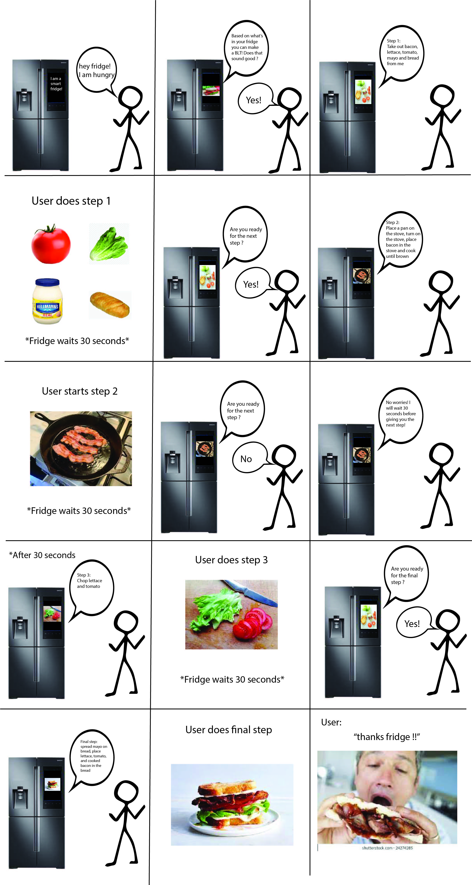

# Chatterboxes
[](https://www.youtube.com/embed/Q8FWzLMobx0?start=19)

In this lab, we want you to design interaction with a speech-enabled device--something that listens and talks to you. This device can do anything *but* control lights (since we already did that in Lab 1).  First, we want you first to storyboard what you imagine the conversational interaction to be like. Then, you will use wizarding techniques to elicit examples of what people might say, ask, or respond.  We then want you to use the examples collected from at least two other people to inform the redesign of the device.

We will focus on **audio** as the main modality for interaction to start; these general techniques can be extended to **video**, **haptics** or other interactive mechanisms in the second part of the Lab.

## Prep for Part 1: Get the Latest Content and Pick up Additional Parts 

### Pick up Additional Parts

As mentioned during the class, we ordered additional mini microphone for Lab 3. Also, a new part that has finally arrived is encoder! Please remember to pick them up from the TA.

### Get the Latest Content

As always, pull updates from the class Interactive-Lab-Hub to both your Pi and your own GitHub repo. As we discussed in the class, there are 2 ways you can do so:

**\[recommended\]**Option 1: On the Pi, `cd` to your `Interactive-Lab-Hub`, pull the updates from upstream (class lab-hub) and push the updates back to your own GitHub repo. You will need the *personal access token* for this.

```
pi@ixe00:~$ cd Interactive-Lab-Hub
pi@ixe00:~/Interactive-Lab-Hub $ git pull upstream Fall2021
pi@ixe00:~/Interactive-Lab-Hub $ git add .
pi@ixe00:~/Interactive-Lab-Hub $ git commit -m "get lab3 updates"
pi@ixe00:~/Interactive-Lab-Hub $ git push
```

Option 2: On your your own GitHub repo, [create pull request](https://github.com/FAR-Lab/Developing-and-Designing-Interactive-Devices/blob/2021Fall/readings/Submitting%20Labs.md) to get updates from the class Interactive-Lab-Hub. After you have latest updates online, go on your Pi, `cd` to your `Interactive-Lab-Hub` and use `git pull` to get updates from your own GitHub repo.

## Part 1.
### Text to Speech 

In this part of lab, we are going to start peeking into the world of audio on your Pi! 

We will be using a USB microphone, and the speaker on your webcamera. (Originally we intended to use the microphone on the web camera, but it does not seem to work on Linux.) In the home directory of your Pi, there is a folder called `text2speech` containing several shell scripts. `cd` to the folder and list out all the files by `ls`:

```
pi@ixe00:~/text2speech $ ls
Download        festival_demo.sh  GoogleTTS_demo.sh  pico2text_demo.sh
espeak_demo.sh  flite_demo.sh     lookdave.wav
```

You can run these shell files by typing `./filename`, for example, typing `./espeak_demo.sh` and see what happens. Take some time to look at each script and see how it works. You can see a script by typing `cat filename`. For instance:

```
pi@ixe00:~/text2speech $ cat festival_demo.sh 
#from: https://elinux.org/RPi_Text_to_Speech_(Speech_Synthesis)#Festival_Text_to_Speech

echo "Just what do you think you're doing, Dave?" | festival --tts
```

Now, you might wonder what exactly is a `.sh` file? Typically, a `.sh` file is a shell script which you can execute in a terminal. The example files we offer here are for you to figure out the ways to play with audio on your Pi!

You can also play audio files directly with `aplay filename`. Try typing `aplay lookdave.wav`.

\*\***Write your own shell file to use your favorite of these TTS engines to have your Pi greet you by name.**\*\*
(This shell file should be saved to your own repo for this lab.)

Bonus: If this topic is very exciting to you, you can try out this new TTS system we recently learned about: https://github.com/rhasspy/larynx

### Speech to Text

Now examine the `speech2text` folder. We are using a speech recognition engine, [Vosk](https://alphacephei.com/vosk/), which is made by researchers at Carnegie Mellon University. Vosk is amazing because it is an offline speech recognition engine; that is, all the processing for the speech recognition is happening onboard the Raspberry Pi. 

In particular, look at `test_words.py` and make sure you understand how the vocab is defined. Then try `./vosk_demo_mic.sh`

One thing you might need to pay attention to is the audio input setting of Pi. Since you are plugging the USB cable of your webcam to your Pi at the same time to act as speaker, the default input might be set to the webcam microphone, which will not be working for recording.

\*\***Write your own shell file that verbally asks for a numerical based input (such as a phone number, zipcode, number of pets, etc) and records the answer the respondent provides.**\*\*

Bonus Activity:

If you are really excited about Speech to Text, you can try out [Mozilla DeepSpeech](https://github.com/mozilla/DeepSpeech) and [voice2json](http://voice2json.org/install.html)
There is an included [dspeech](./dspeech) demo  on the Pi. If you're interested in trying it out, we suggest you create a seperarate virutal environment for it . Create a new Python virtual environment by typing the following commands.

```
pi@ixe00:~ $ virtualenv dspeechexercise
pi@ixe00:~ $ source dspeechexercise/bin/activate
(dspeechexercise) pi@ixe00:~ $ 
```

### Serving Pages

In Lab 1, we served a webpage with flask. In this lab, you may find it useful to serve a webpage for the controller on a remote device. Here is a simple example of a webserver.

```
pi@ixe00:~/Interactive-Lab-Hub/Lab 3 $ python server.py
 * Serving Flask app "server" (lazy loading)
 * Environment: production
   WARNING: This is a development server. Do not use it in a production deployment.
   Use a production WSGI server instead.
 * Debug mode: on
 * Running on http://0.0.0.0:5000/ (Press CTRL+C to quit)
 * Restarting with stat
 * Debugger is active!
 * Debugger PIN: 162-573-883
```
From a remote browser on the same network, check to make sure your webserver is working by going to `http://<YourPiIPAddress>:5000`. You should be able to see "Hello World" on the webpage.

### Storyboard

Storyboard and/or use a Verplank diagram to design a speech-enabled device. (Stuck? Make a device that talks for dogs. If that is too stupid, find an application that is better than that.) 


Write out what you imagine the dialogue to be. Use cards, post-its, or whatever method helps you develop alternatives or group responses. 

The decieve that I am creating is a smart fridge agent that tells the user a recipe based on what's in thier fridge. 

The interaction starts by the user asking the fridge for a recipe. The Fridge will then uses cameras and computer vision to see what is in the users fridge and provide a recipe based on what is available. The fridge will then go through the recipe step by step based on the users conversational cues. Below is an example interaction, at any point the user can ask the fridge what is the next in the recipe, to repeat a step, or ask a specific/ clarifying question about the recipe. 

Person: I am hungry, fridge tell me what I can make ? 

Fridge: Based on what you have in your fridge you can make chicken and salad

Person: Super, how do I get started ?!

Fridge: Open up your fridge and take out the chicken, lettuce, tomato, onion, and avocado 

Person: Done what’s next ?

Fridge: Place a pan on your stove, pour a bit of oil in it, turn on the stove to medium heat, place the chicken in the pan, and season to your liking

Person: How long do I cook the chicken for ? 

Fridge: Until it turns light brown 

Person: Got it! Whats next ? 

Fridge: Chop up veggies in a large bowl and dress to your liking 

*Person finishes cooking and sits down to eat* 

*Person takes first bite* 

Person: Wow, so good!! Thanks fridge 

Fridge: No problem! I always have your back


### Acting out the dialogue

Find a partner, and *without sharing the script with your partner* try out the dialogue you've designed, where you (as the device designer) act as the device you are designing.  Please record this interaction (for example, using Zoom's record feature).

Prior to this excerise I described the device to my partner Jay Chand (jpc342) and the particular use case we were prototyping. 
"The device is a smart fridge that has the ability to look in your fridge and tell you what you can make based on the food available. You are hungry for dinner and are going to ask your fridge for a recipe". 

Audio from partner excersie: 
https://www.youtube.com/watch?v=bcv0Gxq0tYY

Some feedback my partner gave me on my dialogue is that at times it was bit open ended, they didn't know what to do next and the device did not check in on them. To fix this the device will have to have a timer of sorts and check in on the users progress after a certain amount of time with no interaction. Another example is when my device told Jay to dress the salad how he would like, this was too vague and he didn't know what to do. The device should have given more clear options in this case like you have ceasar salad dressing in your fridge or you can dress the salad with oil and vinegar. Also my device didn't report to Jay when he had finished cooking and it was time to eat this was a bit awkward. 

### Wizarding with the Pi (optional)
In the [demo directory](./demo), you will find an example Wizard of Oz project. In that project, you can see how audio and sensor data is streamed from the Pi to a wizard controller that runs in the browser.  You may use this demo code as a template. By running the `app.py` script, you can see how audio and sensor data (Adafruit MPU-6050 6-DoF Accel and Gyro Sensor) is streamed from the Pi to a wizard controller that runs in the browser `http://<YouPiIPAddress>:5000`. You can control what the system says from the controller as well!

\*\***Describe if the dialogue seemed different than what you imagined, or when acted out, when it was wizarded, and how.**\*\*

# Lab 3 Part 2

For Part 2, you will redesign the interaction with the speech-enabled device using the data collected, as well as feedback from part 1.

## Prep for Part 2

1. What are concrete things that could use improvement in the design of your device? For example: wording, timing, anticipation of misunderstandings...

To improve my device, I made the dialogue much simpler and only allowed the user to respond with yes or no answers. This made the interaction and instructions much more clear to the user. Another thing I added per my partners suggestion is some check in points so before the fridge tells the user the next step in the recipe it will ask if they are ready. This makes the interaction much yes vague and the user always will feel engaged. 

2. What are other modes of interaction _beyond speech_ that you might also use to clarify how to interact?

To clarify the interaction and instructions, I incorporated images into the deisgn that go along with the recipe. This allows the user to keep track of what step they are on and gives them some directions on how to make the recipe. In future I would like to add gifs or videos to show the user exactly what to do at each step. I would also like to add buttons to the device so the user also has the option to move through the recipe without communicating with the fridge if they want to. 

3. Make a new storyboard, diagram and/or script based on these reflections.



## Prototype your system

The system should:
* use the Raspberry Pi 
* use one or more sensors
* require participants to speak to it. 

*Document how the system works*

*Include videos or screencaptures of both the system and the controller.*

## Test the system
Try to get at least two people to interact with your system. (Ideally, you would inform them that there is a wizard _after_ the interaction, but we recognize that can be hard.)

Answer the following:

### What worked well about the system and what didn't?
My test users reported that the instructions were clear and they were able to move through the recipe easily. When testing it with users something that was awkward was that the device gives the user time to complete each step and my users were not actually doing the recipe so they just waited in silences for time window for each step to end. Additionally user wished that they were able to skip to the next step when completing the previous before the per set time limit given by the fridge. 

### What worked well about the controller and what didn't?
For the most part the voice controller worked smoothly, users were able to move their the recipe by giving yes and no answers. As mentioned above something about the controller that did not work well was the fact that the users could not skip to the next step if they finished the step in the recipe early. Also if the user reported to the fridge when promoted they need more time on a step the fridge would only give them 30 more secs to complete the step before giving the next step in the recipe. Although the BLT example recipe given here was very simple, user through that this may be problematic with more complex recipes. 

### What lessons can you take away from the WoZ interactions for designing a more autonomous version of the system?
Instructions need to be very clear to the user if they are being given. The device needs to account or try to account for all possible ways the user could interaction with it. In the future when designing Woz interactions, I will try to make my device as reactive as possible. 

### How could you use your system to create a dataset of interaction? What other sensing modalities would make sense to capture?
I could use my system to gain insight how much time it takes for users to complete each step during a recipe. What steps take longer and how much time users like in between hearing the next step. I could also use it to learn how to instruct the user in a clear way they will understand. This is a silly video that shows the importance of giving clear instructions which is definitly essential with recipes:
https://www.youtube.com/watch?v=Ct-lOOUqmyY .
It would also be interesting to see users sucess and satifaction with a recipe depending on what wording was used to give the recipe. For other modalities, it would be interesting to incorporate other smart kitchen appliances. For example, based on the recipe given by the fridge, the stove will know how hot it should be and set its self to the proper heat. The stove could also let the user know when something is done cooking. 
